#Facebook API
Facebook 主要提供的是 REST APIs，稱為 Graph API，早期 version 1 的時候還有一種 SQL API 叫做 FQL (Facebook Query Language)，後來 version 2 以後停止了 FQL 的開發與支援，因此本教學僅說明 Graph API

Facebook 官方的 API 除了網頁版的，還有行動版的：
* Web API: JavaScript、PHP
* Mobile: iOS、Android

###Note
這裡介紹使用 node 模組 fbgraph，可以不需要實際註冊一個 App 即可存取資料，官方版本的 JavaScript SDK 是用來製作應用程式的，所以會要求驗證的 App ID 和 App Secret

#Reference
* Graph API Reference: [https://developers.facebook.com/docs/graph-api/reference/v2.2/](https://developers.facebook.com/docs/graph-api/reference/v2.2/)
* Graph API Explorer: [https://developers.facebook.com/tools/explorer](https://developers.facebook.com/tools/explorer)
* node.js module - fbgraph: [https://github.com/criso/fbgraph](https://github.com/criso/fbgraph)
* Graph API Tree: [http://fancy.cs.nccu.edu.tw/project/fbgraphapi-tree/](http://fancy.cs.nccu.edu.tw/project/fbgraphapi-tree/)

#Prepare
##開發環境
1. 因為我們採用 node.js 作為 JavaScript 的執行環境，所以需要安裝 node.js
2. 安裝完 node.js 以後，安裝 fbgraph:npm install fbgraph
3. 安裝完成以後，目前目錄下面應該會出現 node_modules 資料夾，裡面有 fbgraph 這個模組資料夾
4. 在 terminal 輸入 node 進入 node.js 的 REPL 模式，輸入 var fb = require('fbgraph') 如果沒有出現錯誤，就是載入成功，也就是安裝成功了

##取得 Access Token
使用大部分的 API 都需要 Access Token，這個 token 的原理有點特別，在這裡先說明要怎麼取得一個 App 的 Access，請到 [https://developers.facebook.com/tools/explorer](https://developers.facebook.com/tools/explorer)，在畫面右上方有個『Get Access Token』的按鈕
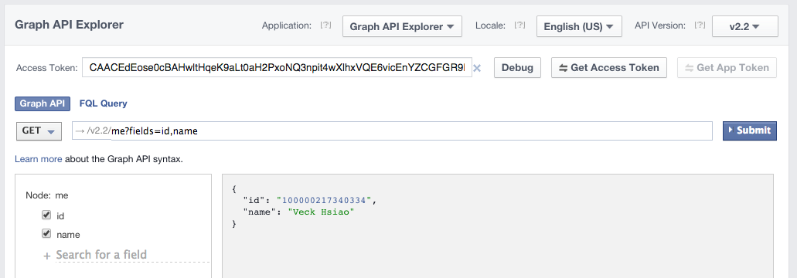

點進去後，可以在這裡勾選用這個 Access Token 的程式可以做哪些事情，2.2 版的 Graph API 只剩下兩種 Permission
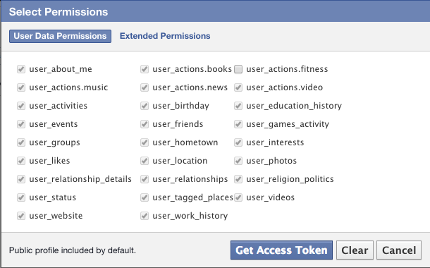
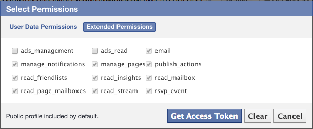

勾選完畢以後按下『Get Access Token』，就可以得到 access token，要注意的是，每次勾選不同的項目後產生的 acess token 都不一樣喔！
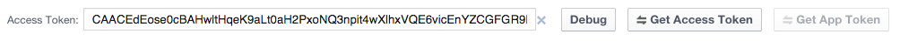

###Note
如果你是要做一個 Web App 或 Mobild App，你需要到 [https://developers.facebook.com/apps/](https://developers.facebook.com/apps/) 去註冊一個 App，並取得 App ID 和 App Secret。

#Code for API
首先我們要了解一下 API 文件的結構，若覺得官方文件結構不清楚可以參考 [Graph API Tree](http://fancy.cs.nccu.edu.tw/project/fbgraphapi-tree/)
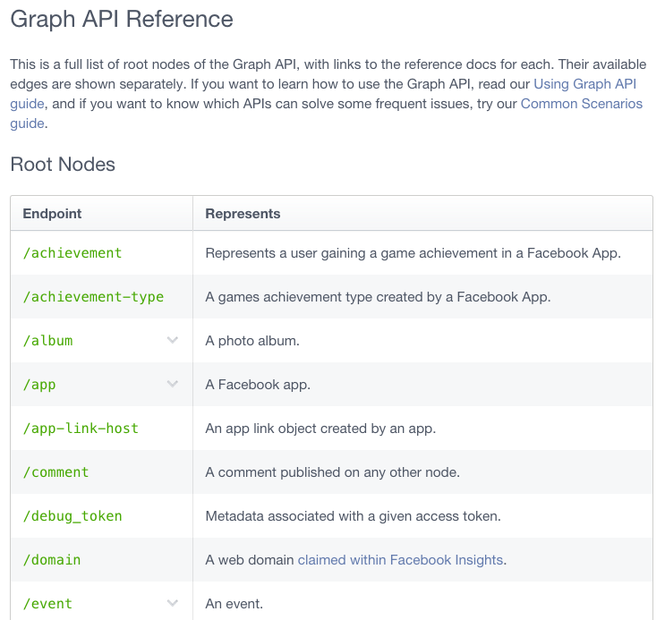

首先來到 Graph API Reference，可以看到主要的 Root API 有哪些，例如上圖的 comment 就是表示 comment 是專門由一個 Root API 統一管理的，往下拉我們找到 `/user`，以此做示範，點進去可以看到這個 API 的細節
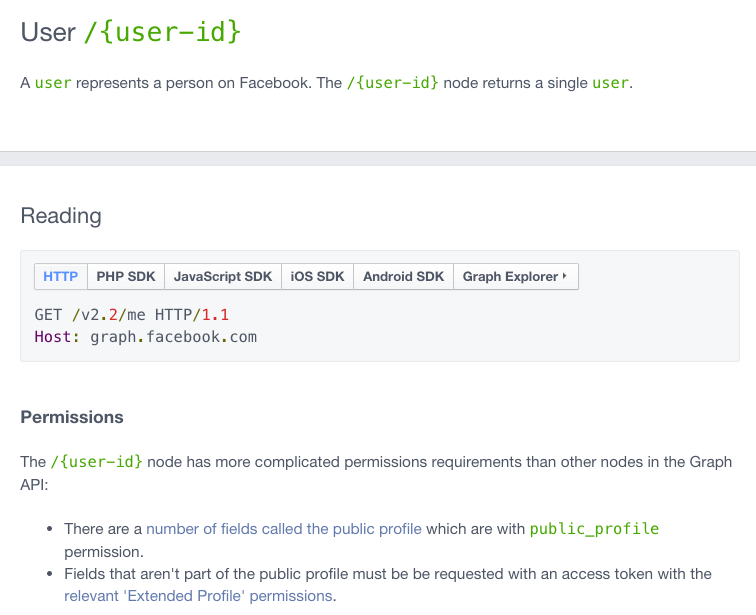
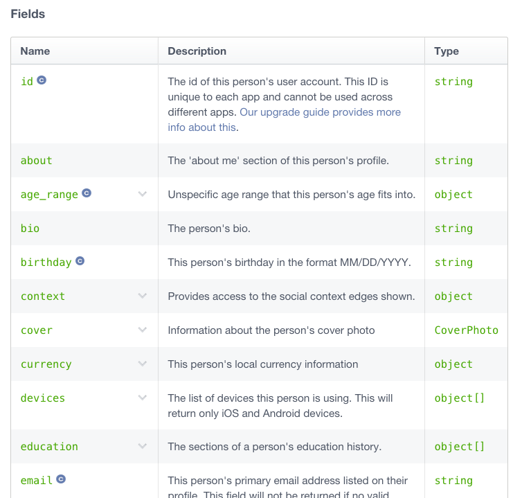

這裡顯示了 user 這個 API 的使用方式是 GET，用法是向 `https://graph.facebook.com/v2.2` 請求某個 {user-id}，其中 {user-id} 要去一個帳戶的個人頁面查看原始碼(或是有其它的方法還不知道，因為現在的 Graph API 已經不允許直接用 username 做查詢請求了)，不過自己的資訊還可以輸入 `me` 查詢，如：`https://graph.facebook.com/v2.2/me`

頁面下方的 Fields 就是請求時 GET 方法可以帶的參數，以 GET 方法帶參數的請求方式，是在 URL 後面用 `?fields=field1&field2&field3&...`，例如：`https://graph.facebook.com/v2.2/me?fields=id&email`

##使用 Graph API Explorer
我們可以在剛才取得 Access Token 的地方試用 API 的查詢結果，例如查詢 `https://graph.facebook.com/v2.2/me?fields=id&email`
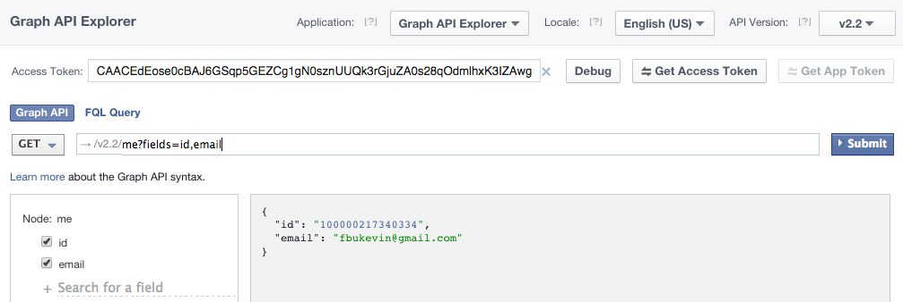

###Note
但是這個地方查詢到的內容未必跟你 App 存取到的相同，這是因為 Graph API Explorer 本身也是一個 App，這個應用程式有自己的 Access Token，且必定跟你取得的不同且權限更高。

##建立 fb 物件和設定 Access Token
程式一開始，我們需要引入 fbgraph 這個模組和設定取得的 Access Token
```
var fb = require('fbgraph');
var access_token = 'CAACEdEose0cBAPYHxZAiMNSduuKEe0qNQ70tTZC7RWsFEOB2hA8m9v5XxBZB9bcvUItypPYq5vhlG5VIw515jZCCfUSfE2fu7dtXjQcfXxUjpLMqzBaqu9ZCbeiNiBS6iYcW0ZCyFDndAQRrrtPvKfKBUwFN6RXPeZBoLmwyZCHjNksOZCL5YUZABSpW371KjO7eA9dA7n9gQq5eYliqn169wX';

fb.setAccessToken(access_token);
```
###Note
Access Token 會過期，需要重新取得。

##Coding
我們以存取和發文到動態時報(feed)上的內容來做使用示範，我們可以到 /user/feed 的頁面去查看使用方法

###GET API
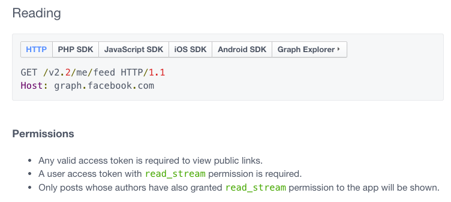
讀取動態時報內容跟查詢 user 資料的方法是一樣的，他是用 GET 方法來請求

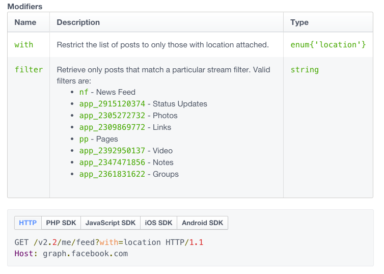
頁面下方還列出了可以帶的 modifier，例如 with=location，意思就是要查詢有 location 的動態
```
fb.get("100000217340334/feed", function(err, res){ 
	console.log(res); 
});
```
如此存檔以後，就可以用 node 來執行了，以下是回傳的 JSON 片段：
```
{ id: '100000217340334_1035175176499717' }
{ data: 
   [ { id: '100000217340334_1035134526503782',
       from: [Object],
       story: 'Veck Hsiao commented on a photo.',
       story_tags: [Object],
       privacy: [Object],
       type: 'status',
       created_time: '2015-01-14T06:00:26+0000',
       updated_time: '2015-01-14T06:00:26+0000' },
     { id: '100000217340334_1034881959862372',
       from: [Object],
       story: 'Veck Hsiao likes 賴雅妍 MeganLai @ PTT.',
       story_tags: [Object],
       picture: 'https://fbcdn-profile-a.akamaihd.net/hprofile-ak-xfp1/v/t1.0-1/c0.0.50.50/p50x50/10562951_10152640983319096_6631506665923378310_n.jpg?oh=b67d31415bf596258b532f3b0f4065a6&oe=55678B1D&__gda__=1429949675_8c642eee6a7d7f0a2f9b90825c888832',
       link: 'https://www.facebook.com/Meganlai.in.PTT?ref=stream',
       icon: 'https://fbstatic-a.akamaihd.net/rsrc.php/v2/yN/r/xC785tTCIQO.gif',
       actions: [Object],
       privacy: [Object],
       type: 'link',
       application: [Object],
       created_time: '2015-01-13T18:01:18+0000',
       updated_time: '2015-01-13T18:01:18+0000' },
```

實際的動態時報內容
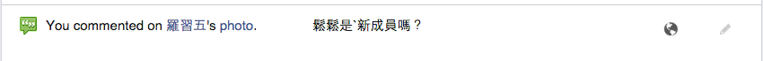


###POST API
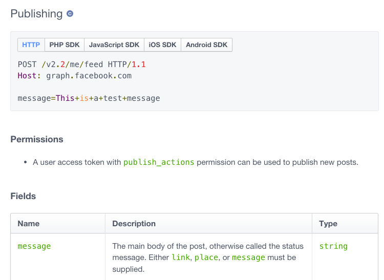
要發表文章到動態時報上，採用的是 POST 方法

```
var postWall = {
   message: "This is a test of publish data to feed.",
   privacy: { value: "SELF"}		// 設定這則推文只有自己看的到
};
fb.post("100000217340334/feed", postWall , function(err, res{
	 console.log(res); 
});
```
其中 postWall 的參數與參數可設定值請參考下方更多的 Fields
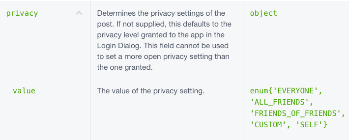 

執行結果
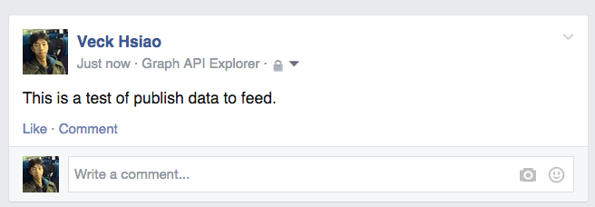
