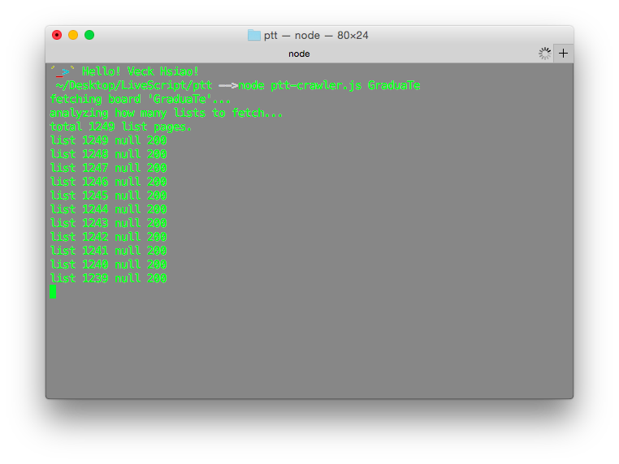
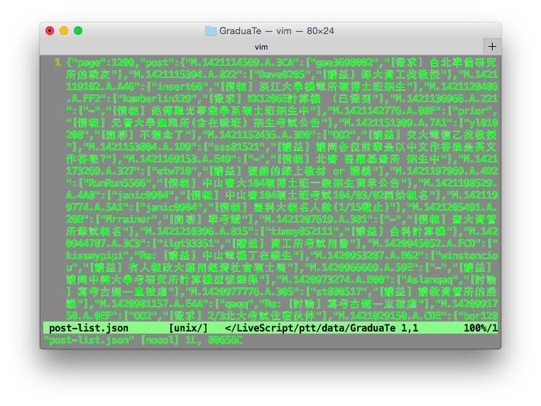
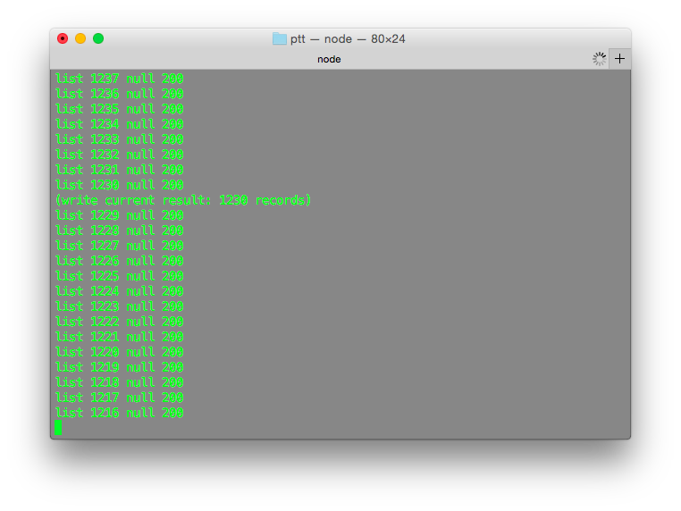
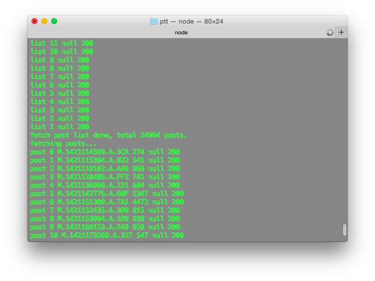
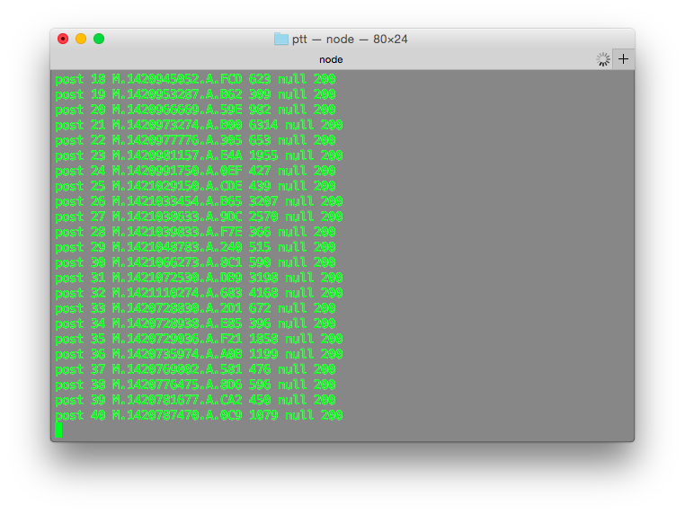
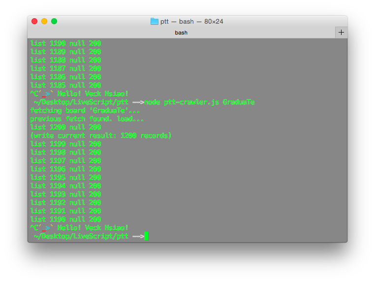

#Introduction

使用 [https://github.com/zbryikt/ptt-crawler](https://github.com/zbryikt/ptt-crawler) 這個 PTT 爬蟲專案來做說明

**不需要寫程式，非資科的助理也可以使用來抓 PTT 的文章**

#Prepare
原作使用的是 JavaScript 的方言 LiveScript，所以要安裝 LiveScript：`npm install -g LiveScript` 

**給非資科助理：npm 是一個工具，需要先安裝 node.js 這個東西就可以用 npm 了** (希望不要看到這裡就放棄了 @@ )

#Usage
必要的兩個檔案：
* crawler.ls - 主要的爬蟲程式
* package.json - 程式會用到的相依套件在此設定

因此只需要這兩個就可以做最簡單的文章抓取

1. 安裝相依套件 `npm install`
2. 抓文章 `lsc crawler.ls <看板名稱>` (<看板名稱> 是不分大小寫)

放著讓程式抓，抓下來的文章會存在同一個目錄下產生的 data 資料夾中


###運作方式
1. 這個爬蟲會先抓 post 的 metadata (post list)
2. 每抓 30 個 post list 就會寫到 data/post-list.json 中


3. 全部的 post list 抓完後才開始抓 post 的內容，最後存在 data/post 中，這步驟就是編寫邊存，一篇文章一個檔案



###如果中間斷掉了？

重新啟動程式就好，這個程式支援 **續抓**

他會說『Previous fetch found.』，然後從斷掉前還沒寫入的第一個開始續抓

###Compile to JavaScript
`lsc -c crawler.ls`

###Use node to run
`node crawler.js`

##Post-list 示範資料
* 看板：graduate

```
{
	"page":0,
	"post":{
		"M.1421114569.A.3CA":["gae3698002","[徵求］台北準備研究所的戰友"],
		"M.1421115394.A.822":["Dave0205","[請益] 師大資工找教授"],
		...
		}
}
```

##Post 示範資料 
* 看板：graduate
* 文章編號：M.1397374778.A.10C

```
 作者  winnie3100 (winnie) 
 看板  graduate 
 標題  [請益] 有關實習 
 時間  Sun Apr 13 15:39:35 2014 
如果已經要進入研究所，是不是就不宜申請暑期實習？

--
Sent from my Android

--
 ※ 發信站: 批踢踢實業坊(ptt.cc), 來自: 140.113.136.221
  ※ 文章網址:  http://www.ptt.cc/bbs/graduate/M.1397374778.A.10C.html 
 
 推   MIKEmike07  :看教授阿，如果要你先進lab的，問問教授通不通融   04/13 15:46
 
 →   MIKEmike07  :通常會讓你去   04/13 15:46
 
 →   winnie3100  :嗯嗯 感謝   04/13 15:50
 
 推   h56999  :早進lab不代表早畢業,但你有可能延兩個月畢業..   04/13 16:01
 
 →   DanSir  :商管的話就一定可以實習   04/13 16:32
 
 推   guillotine  :教授喜歡有上進心 對未來有規劃的人  申請吧   04/13 17:05
 
 →   h56999  :樓上.我覺得教授比較喜歡幫他賺點數接產學做國科會計畫   04/13 17:11
 
 →   MedEngineer  :教授喜歡上進心 但要用在自己Lab的實驗與計畫上...   04/13 17:24
 
 →   guillotine  :看來樓上二位歷練不錯  所以說要試教授不讓你實習   04/13 17:42
 
 →   guillotine  :果斷放生他   04/13 17:42
 
 推   a26732300  :申請啊，暑假又沒課，晚上看paper，白天實習，你可以用   04/13 21:11
 
 →   a26732300  :的時間很多，咪聽那天就跟公司請假就好   04/13 21:12
 
 推   a26732300  :大部分老闆都會說不影響研究進度為前提下，自己決定   04/13 21:14  
```

#Issue
* 我覺得可以改進成加上 count、id、time 參數，讓抓資料更多元