#Twitter API
Twitter 提供的 API 有很多種，水火團隊近期最主要使用的 API 有兩個：
* REST APIs - 最基本的網頁 API，提供以 GET 和 POST 兩種 HTTP 資料傳輸方法存取或操作應用程式的 API
* Streaming APIs - 提供最即時的推文資訊
* (Search APIs - 早期的 API，目前好像併入 REST APIs 中了)

目前在 JavaScript (node.js) 有一個很方便的套件 `node-twitter`，且涵蓋 REST, streaming and search，因此介紹會直接以此套件作為呼叫的模組：[https://github.com/desmondmorris/node-twitter](https://github.com/desmondmorris/node-twitter)

#Reference
* REST APIs Documentation: [https://dev.twitter.com/rest/public](https://dev.twitter.com/rest/public)
* Streaming APIs Documentation: [https://dev.twitter.com/streaming/overview](https://dev.twitter.com/streaming/overview)
* API Console Tool - Exploring the Twitter API: [https://dev.twitter.com/rest/tools/console](https://dev.twitter.com/rest/tools/console)

#Prepare
開始使用 API 之前，需要有些事前的準備

##開發環境
1. 因為我們採用 node.js 作為 JavaScript 的執行環境，所以需要安裝 node.js
2. 安裝完 node.js 以後，安裝 node-twitter:`npm install twitter`
3. 安裝完成以後，目前目錄下面應該會出現 `node_modules` 資料夾，裡面有`twitter`這個模組資料夾
4. 在 terminal 輸入 node 進入 node.js 的 REPL 模式，輸入 `var twitter = require('twitter')` 如果沒有出現錯誤，就是載入成功，也就是安裝成功了

##註冊 App
社群媒體提供 API 的目的是為了給你開發的應用程式(App)呼叫使用，因此你必須到開發網頁去註冊你的 App，而目前的社群媒體 API 都會採用認證授權的機制，因此你註冊完 App 以後，會取得 Keys

1. Go [https://apps.twitter.com/](https://apps.twitter.com/)
2. 選擇『Create New App』
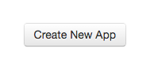

3. 填寫 App 基本資料，其中 Website 需要是一個網址，因為 App 主要是提供網頁存取，因此需要一個 URL，但是你的程式未必要在這個 URL 才能呼叫 API，`如果你暫時沒有 URL，可以先隨便填一個網址就好`
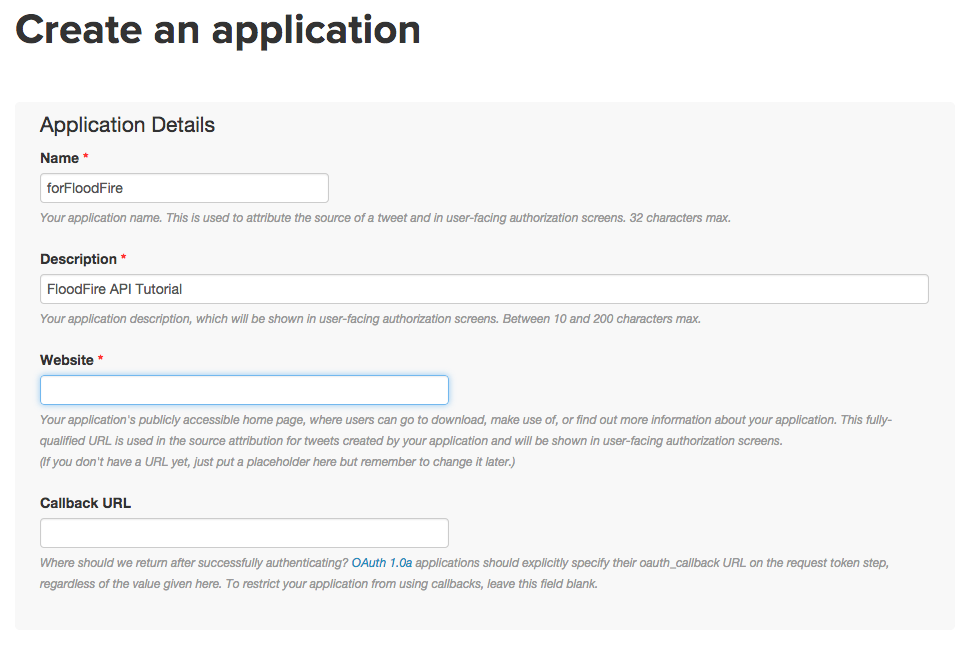
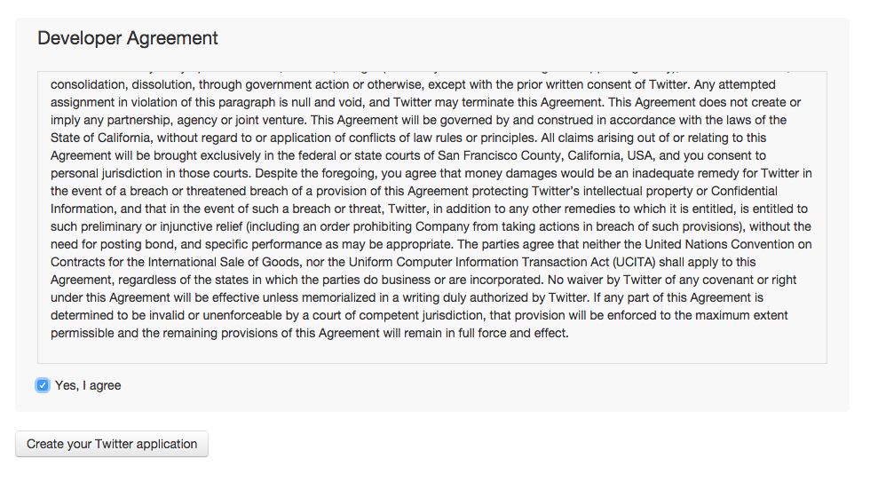
4. 沒問題的話就註冊好 App 了
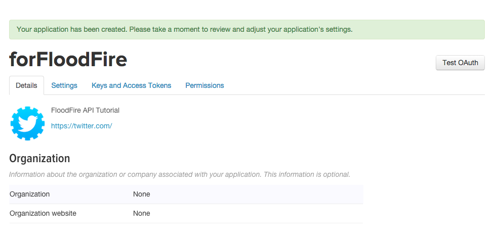
5. 接著切換到『Keys and Access Tokens』的頁籤，這裡一開始你可以看到這個 App 專屬的 API Key 和 API Secret，這兩個是呼叫 API 認證的鑰匙之二，其中 API Secret 應該要保護起來不能讓人知道
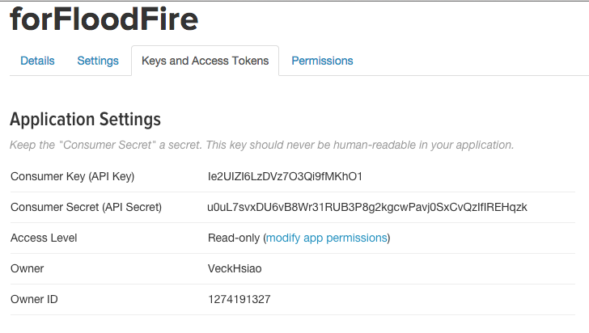
6. 接著我們還需要另外兩把 Key，拉到下面的畫面，有『Your Access Token』，一開始是沒有的，按下『Create my access token』後就可以產生 Access Token 和 Access Token Secret
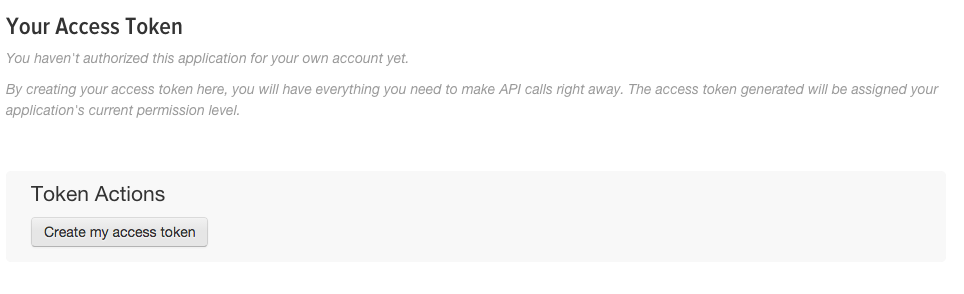
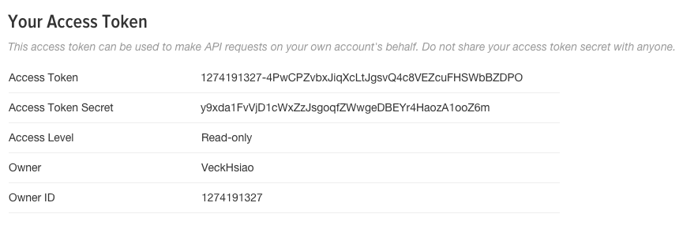

至此，就完成的前置的作業，可以開始寫 code 使用 API 了！

##寫入權限
如果你的 App 是有 write 的動作，例如發推文(tweeting)，因為預設是 Read-only，因此你需要到 Permissions 的頁籤去修改權限，而 access_token 也要重新產生一組喔！
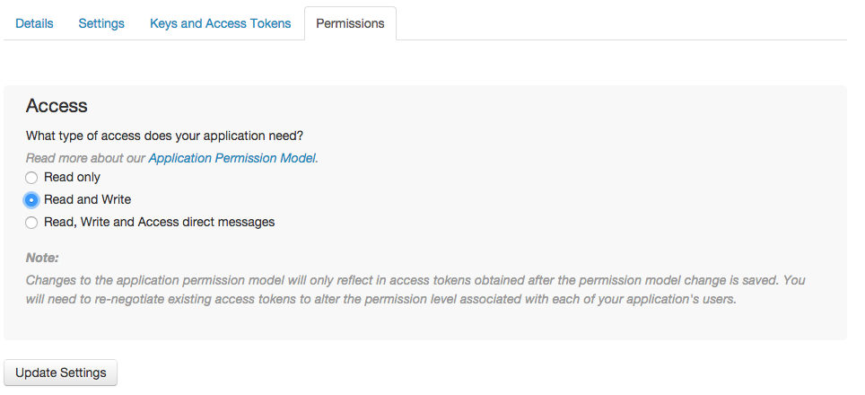

#Code for API
##REST APIs 
REST API 主要採用 HTTP 的 GET 與 POSt 兩種資料傳輸的方式來提供資料存取，在文件會有像這樣的項目：
```
GET statuses/mentions_timeline
GET statuses/user_timeline
GET statuses/home_timeline
GET statuses/retweets_of_me
GET statuses/retweets/:id
GET statuses/show/:id
POST statuses/destroy/:id
POST statuses/update
POST statuses/retweet/:id
POST statuses/

...
```
第一個名稱就是採用的 HTTP 方法，第二個名稱是 API 的分類，地三個名稱是 API 的名稱，最後有可能帶冒號的名稱是要求的 RESTful 參數

以 `statuses/home_timeline` 這個 API 為例，它使用 GET 方法，分類在 statuses 下，名稱是 home_timeline，沒有 RESTful 參數
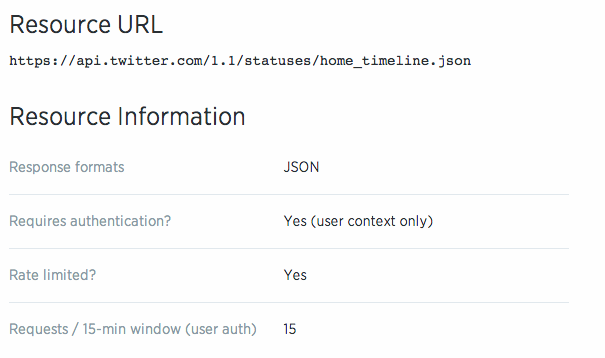

在這個 API 的頁面可以看到 Resource URL、Resource Information 和 Parameters，URL 就是你 App 存取資料的網址，也就是 API 這個程式的位置，Information 那邊顯示回傳的資料格式是 JSON，所以可以用 JavaScript (或其他語言的 Json 處理方法)直接處理回傳的內容

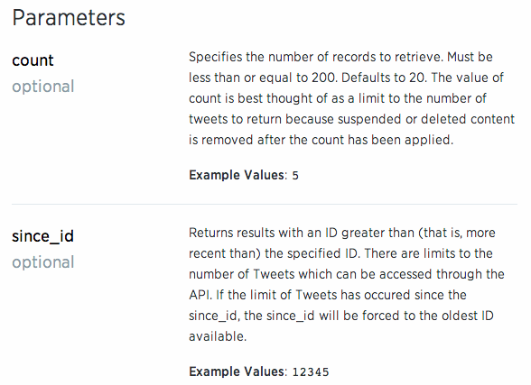
還有 Parameters 那個表格列出了你可以一起傳送給 API 的參數，例如 count 就是說你只要取得 count 個 tweet 就好，since_id 是設定要開始抓取的 id

然後就可以寫程式囉！
```
/* 載入 node-twitter 模組 */
var Twitter = require('twitter');

/* 建立 Twitter 物件，並設定好我們註冊後取得的 4 個 keys */
var client = new Twitter({
  consumer_key: 'Ie2UIZI6LzDVz7O3Qi9fMKhO1',
  consumer_secret: 'u0uL7svxDU6vB8Wr31RUB3P8g2kgcwPavj0SxCvQzIfIREHqzk',
  access_token_key: '1274191327-4PwCPZvbxJiqXcLtJgsvQ4c8VEZcuFHSWbBZDPO',
  access_token_secret: 'y9xda1FvVjD1cWxZzJsgoqfZWwgeDBEYr4HaozA1ooZ6m'
});

/*
 * 用 GET 方法呼叫 API 
 * 其中 .get() 的第一個參數就是 API 名稱，第二個參數是 callback 函數
 * (有關 callback 函數，簡單來說就是資料回傳回來要做的事情)
 */

client.get('statuses/home_timeline', function(error, body, response){
   if(error) throw error;

   console.log(body); // body 是回傳的 JSON 檔案  
});
```
存檔成 rest.js ，接著就可以用 `node rest.js` 執行，以下是執行以後取得的結果 JSON 檔片段：
```
[ { created_at: 'Tue Jan 13 16:52:57 +0000 2015',
    id: 555044844000018400,
    id_str: '555044844000018434',
    text: 'RT @Ri_Science: Inspired by the #xmaslectures? Submit your hacks to the #hackgallery, like this door unlocker http://t.co/TEy6WVmXhq http:/…',
    source: '<a href="https://about.twitter.com/products/tweetdeck" rel="nofollow">TweetDeck</a>',
    truncated: false,
    in_reply_to_status_id: null,
    in_reply_to_status_id_str: null,
    in_reply_to_user_id: null,
    in_reply_to_user_id_str: null,
    in_reply_to_screen_name: null,
    user: 
     { id: 302666251,
       id_str: '302666251',
       name: 'Raspberry Pi',
       screen_name: 'Raspberry_Pi',
       location: 'Cambridge, UK',
       profile_location: null,
       description: 'The official Twitter account for the Raspberry Pi Foundation. News and info about our low-cost mini PC.',
       url: 'http://t.co/1Ol8uNLO82',
       entities: [Object],
       protected: false,
       followers_count: 185664,
       friends_count: 537,
       listed_count: 3960,
       created_at: 'Sat May 21 15:20:40 +0000 2011',
       favourites_count: 413,
       utc_offset: 0,
       time_zone: 'London',
       geo_enabled: false,

       ...
```
實際去看你的 twitter 首頁
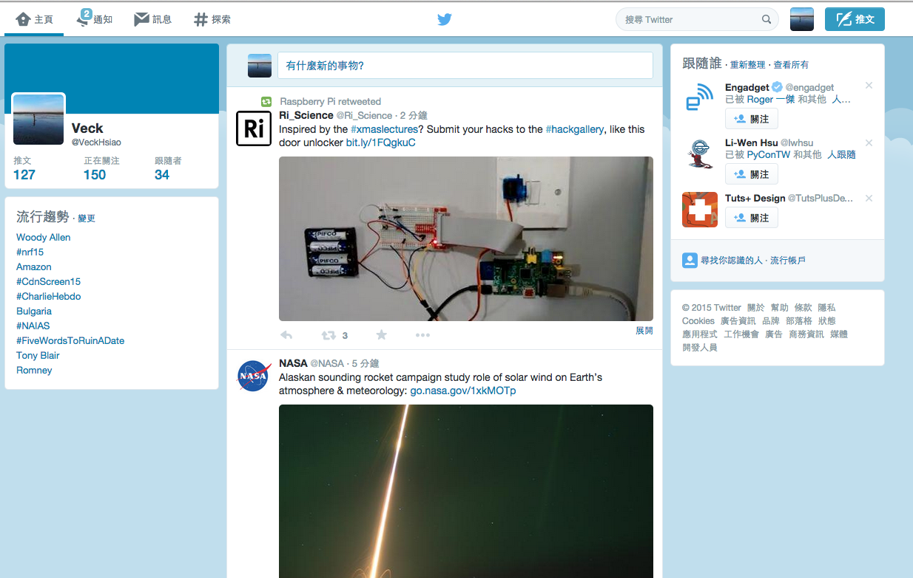
第一個推文就是 `RT @Ri_Science: Inspired by the #xmaslectures? Submit your hacks to the #hackgallery, like this door unlocker http://t.co/TEy6WVmXhq http:/…'`

要用 POST 的 API 也是直接把 .get 改成 .post 就可以了，而通常 POST 會帶參數值，如果要帶參數，不論 GET、POST，就在函數的 API name 和 callback function 之間加入一個參數 JSON 就可以了，例如我們用 POST 方法的 statuses/update API 來發文：
```
var status = "Should not longer than 140 characters.";
client.post('statuses/update', {status: status}, function(error, body, response){
	if(error) console.log(error);

	console.log(body);
});
```
記得要去修改註冊的 App Permission 為 Read and write，然後重新產生 Access Token，就可以執行了。
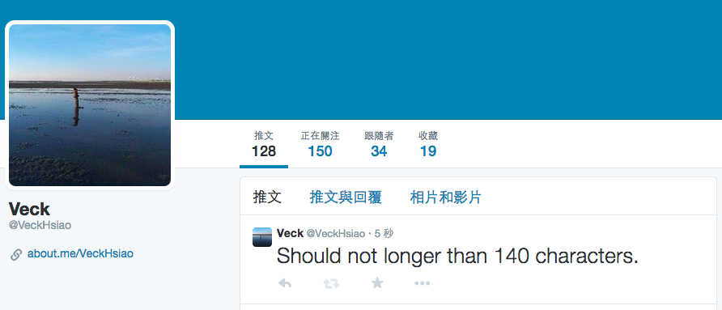

##Streaming APIs
Streaming API 的概念就是『即時新聞』，特色是像水流(stream)一般一直回傳目前最新的公開推文
```
client.stream('statuses/filter', {track: 'javascript'}, function(stream) {

    stream.on('data', function(tweet) {
        console.log(tweet.text);
    });

});
```
這裡我們去存取公開推文上所有包含 'javascript' 這個關鍵字的即時推文，filter 是提供關鍵字篩選的 API，參數 track 就是我們要下的關鍵字，並印出回傳的資料中內文(data)的部份，執行結果如下
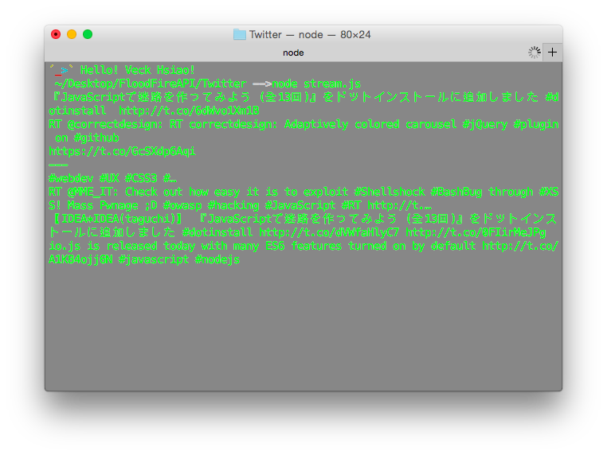
有時候會看起來好像卡住沒在動，但是過一陣子就又跑出訊息，這很正常，因為這個關鍵字本來就不是每一秒鐘(甚至以電腦發送 request 的時間觀是每微秒)都有人在發送推文，所以有些實作 (可參考之前團隊學長做的 Twitter 資料蒐集平台) 都是長時間的發送存取請求，來監控一段時間內的特定關鍵字推文有哪些。
