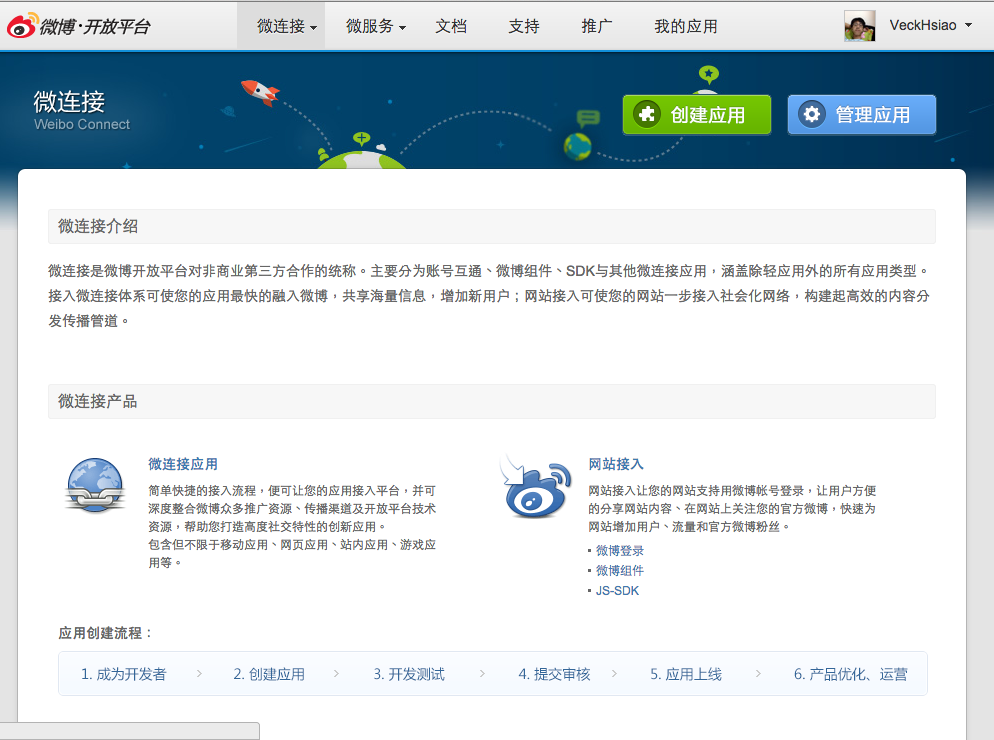
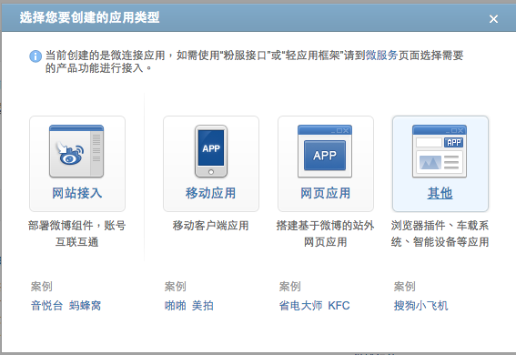
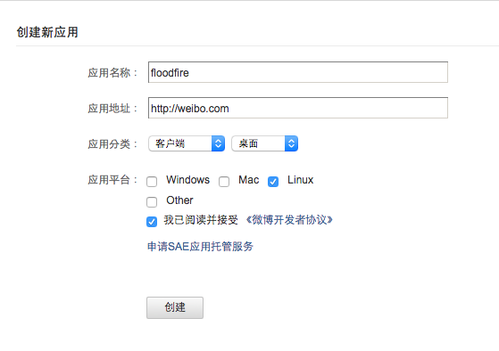
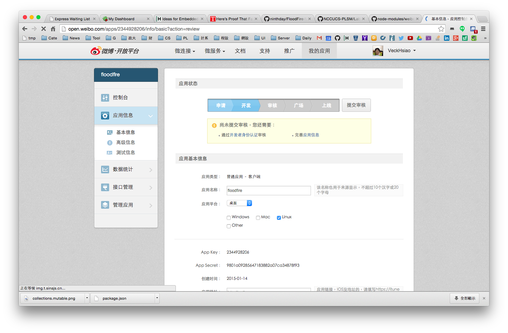
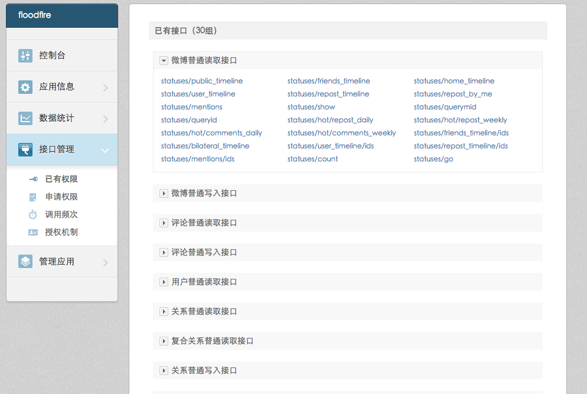
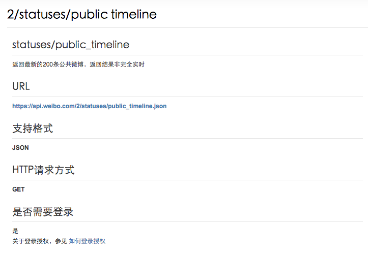
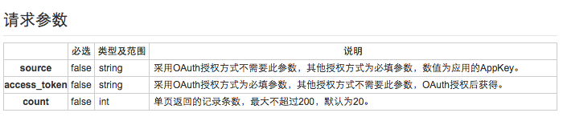
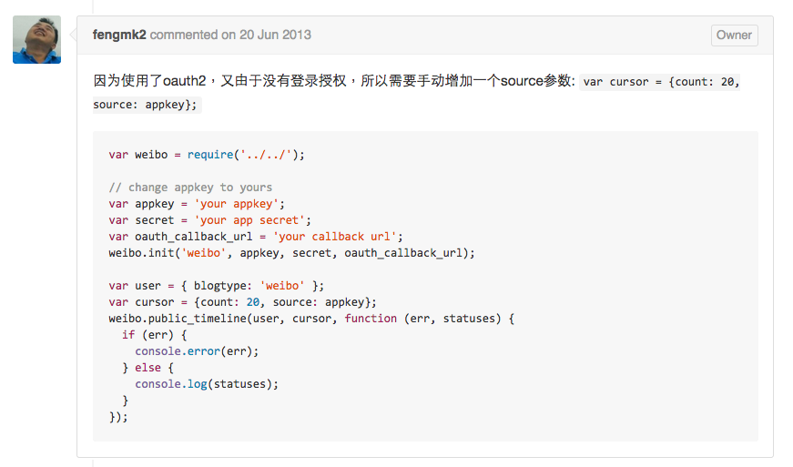

#Weibo API
(施工中...)

本文主要以中國大陸最大宗的 Sina Weibo 做示範

使用官方認證的 JavaScript SDK: [https://github.com/node-modules/weibo](https://github.com/node-modules/weibo)

#Referecen
* Sina Weibo Connect: [http://open.weibo.com/development](http://open.weibo.com/development)

#註冊 App





#Code for API



```
var weibo = require('weibo');

// change appkey to yours
var appkey = 'your appkey';
var secret = 'your app secret';
var oauth_callback_url = 'your callback url';
weibo.init('weibo', appkey, secret, oauth_callback_url);

var user = { blogtype: 'weibo' };
var cursor = {count: 20, source: appkey};
weibo.public_timeline(user, cursor, function (err, statuses) {
  if (err) {
    console.error(err);
  } else {
    console.log(statuses);
  }
});
```

#Problem
```
{ [PublicTimelineError: source paramter(appkey) is missing]
data:
{ error: 'source paramter(appkey) is missing',
error_code: 10006,
request: '/2/statuses/public_timeline.json' },
name: 'PublicTimelineError' }
```
[https://github.com/node-modules/weibo/issues/31](https://github.com/node-modules/weibo/issues/31)


#Current Problem
嚴格講起來這樣子就可以了，不過新浪那邊似乎沒做的很完善，明明註冊好了也設定好了卻一直有`applications over the unaudited use restrictions!`的 error，開發者討論區很多人遇到此問題不過還沒什麼有效解決方法

另外，原本有提供類似 Facebook Graph API Explorer 的工具，目前似乎停用了